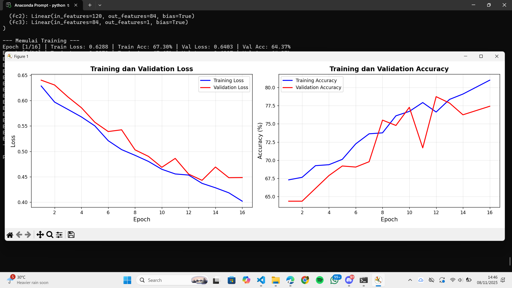
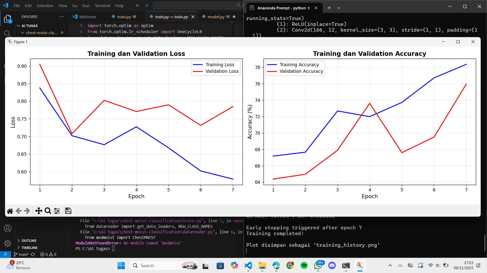

# Analisis
1. Perubahan Utama
a. Arsitektur Model
    Repo (DenseNet):
    Menggunakan DenseNet dengan beberapa dense block, jumlah parameter besar, serta classifier berukuran hidden dim 256. Kelebihan: kemampuan representasi tinggi, cocok untuk dataset kompleks.
    SimpleCNN:
    Menggunakan dua convolutional layer dengan fully connected layer kecil.
    Kelebihan: pelatihan lebih cepat dan ringan untuk debugging. Kekurangan: kapasitas representasi rendah, akurasi kemungkinan lebih rendah pada dataset besar.

b. Training Loop dan Optimisasi

1. Repo (ChestXrayTrainer):

- Menggunakan device (CPU/GPU).
- ptimizer: AdamW.
- Scheduler: OneCycleLR.
- Ada gradient clipping dan early stopping.
- Menggunakan BCEWithLogitsLoss dengan pos_weight untuk class imbalance.
- Menyimpan model terbaik (best_model.pth) dan riwayat ke self.history.

2. SimpleCNN Script:

- Optimizer: Adam tanpa weight decay.
- Tidak ada scheduler, gradient clipping, atau early stopping.
- Tidak menggunakan .to(device) untuk GPU.
- Hanya menyimpan hasil ke list lokal tanpa file output JSON.

Alasan perubahan: versi sederhana difokuskan untuk eksperimen cepat dan konsep dasar training loop.

c. Hyperparameter & Setup

- Densenet: epochs=15, batch_size=32, base_lr=0.001, max_lr=0.01.
- Simple CNN: EPOCHS=16, BATCH_SIZE=16, LEARNING_RATE=0.0003.
Perbedaan ini memengaruhi convergence dan hasil validasi.

2. Dampak Praktis dari Perubahan

a. simple cnn

Hasil analisis performa model selama 16 Epochs menunjukkan tren pembelajaran yang positif, namun diiringi indikasi overfitting yang signifikan. Secara umum, baik Training Loss maupun Training Accuracy menunjukkan kinerja yang superior dan terus membaik hingga akhir pelatihan (Train Acc: 67.30%), sementara kinerja pada data validasi mencapai titik moderat (Val Acc: 64.37%). Analisis mendalam pada kurva loss mengindikasikan bahwa setelah Epoch ke-12, terjadi divergensi tajam di mana Training Loss terus menurun, namun Validation Loss mulai berfluktuasi dan meningkat, menandakan bahwa model telah terlalu spesifik mempelajari data latih sehingga kemampuan generalisasinya menurun. Oleh karena itu, diperlukan penerapan teknik regulasi, seperti Early Stopping atau Dropout, untuk membatasi kompleksitas model dan mencapai kinerja validasi yang optimal.

b. densenet

Hasil pelatihan yang dihentikan pada Epoch ke-7 oleh mekanisme early stopping menunjukkan model memiliki kapabilitas pembelajaran yang baik pada data pelatihan, namun rentan terhadap overfitting dan volatilitas. Training Loss (garis biru) menurun konsisten dan Training Accuracy meningkat tajam hingga mencapai puncaknya (sekitar 79%), namun Validation Loss (garis merah) menunjukkan fluktuasi signifikan dan bertahan jauh di atas Training Loss. Kesenjangan yang lebar ini, diperkuat oleh Validation Accuracy yang tertinggal dan tidak stabil (mencapai sekitar 75% pada Epoch 7), mengonfirmasi bahwa model tidak mampu menggeneralisasi dengan efektif. Oleh karena itu, early stopping pada Epoch 7 merupakan langkah krusial untuk mencegah penurunan kinerja validasi lebih lanjut.

3. Kesimpulan
Perubahan dari DenseNet ke SimpleCNN memberikan sejumlah dampak praktis terhadap proses pelatihan dan hasil model. Secara umum, SimpleCNN memiliki keunggulan dalam hal kecepatan dan efisiensi komputasi. Model ini lebih ringan dan dapat dilatih dengan cepat bahkan menggunakan CPU, sehingga cocok digunakan untuk tahap uji coba awal atau debugging. Namun, karena arsitekturnya sederhana dan jumlah parameternya sedikit, SimpleCNN cenderung mengalami underfitting dan menghasilkan akurasi validasi yang lebih rendah dibandingkan DenseNet.

Sebaliknya, DenseNet memiliki kapasitas representasi yang jauh lebih tinggi sehingga mampu mencapai akurasi yang lebih baik jika dilatih dengan benar. Kelemahan utamanya adalah waktu pelatihan yang lebih lama dan kebutuhan komputasi yang lebih besar, terutama karena model ini optimal dijalankan pada GPU. Dari sisi stabilitas, DenseNet lebih unggul karena menggunakan scheduler seperti OneCycleLR serta teknik gradient clipping yang membantu menjaga konvergensi selama pelatihan. Sementara itu, SimpleCNN yang tidak dilengkapi mekanisme tersebut cenderung kurang stabil dan sensitif terhadap pengaturan learning rate.

Dari segi kompleksitas implementasi, SimpleCNN lebih mudah dipahami dan diubah karena struktur kodenya sederhana, sedangkan DenseNet bersifat lebih modular dan lengkap, dengan pengaturan yang mendukung pelatihan skala besar. Dengan demikian, pemilihan model bergantung pada tujuan eksperimen: SimpleCNN lebih tepat untuk pengujian cepat dan eksplorasi konsep, sementara DenseNet lebih ideal untuk mencapai performa optimal dalam skenario penelitian atau aplikasi nyata.

